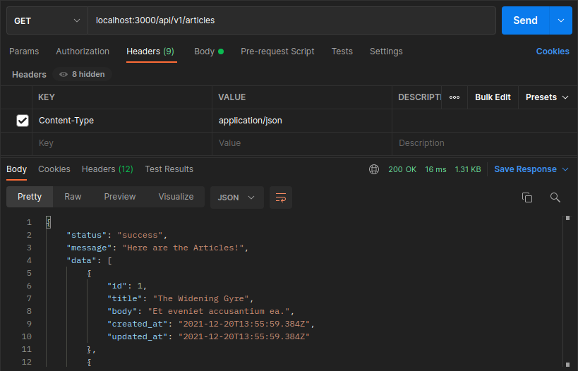
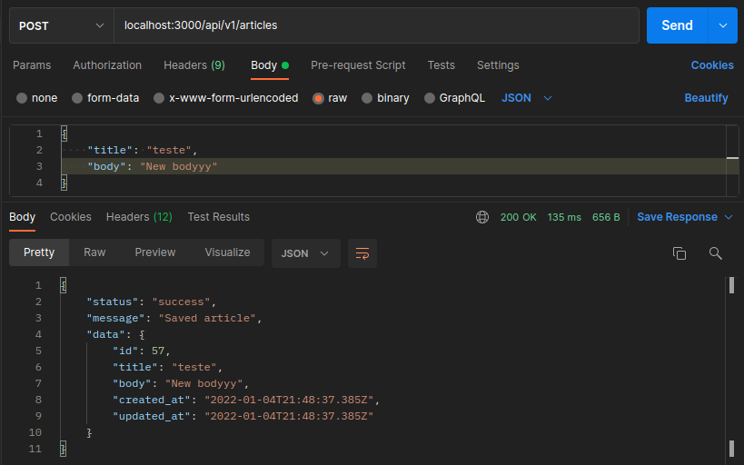
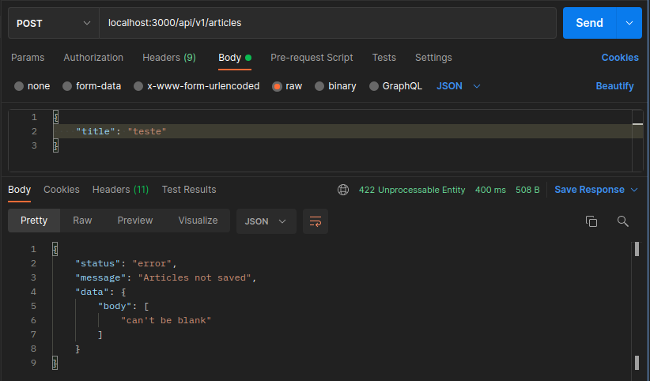
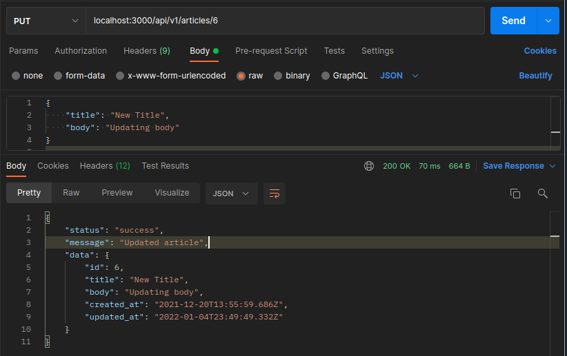
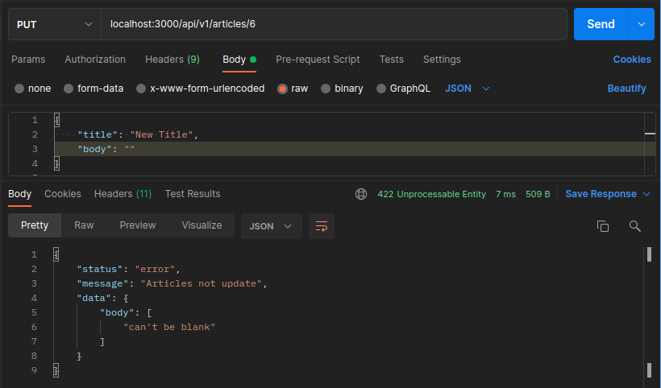
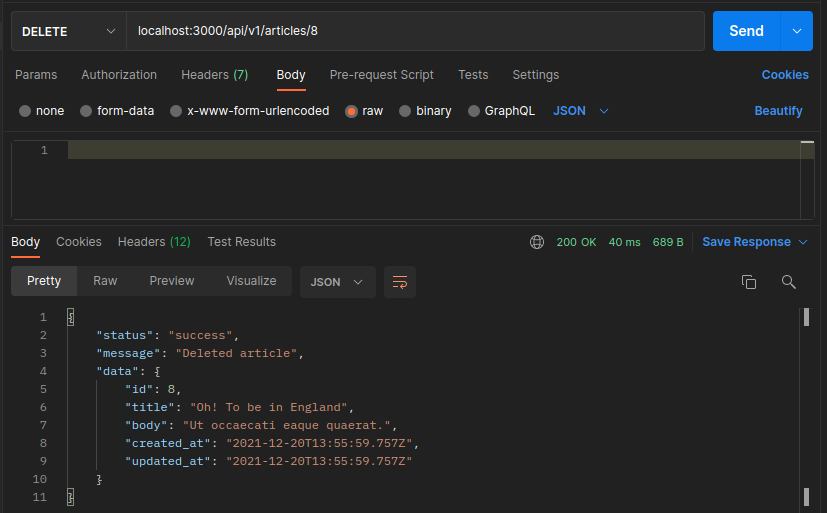

<h1 align="center">My Articles API</h1>
 

## :file_folder: GET

Get all articles.   

## :file_folder: POST
Create article with success 

Create article with error

## :file_folder: PUT
Updated articles.   

Update article - Invalid body request.   

## :file_folder: DELETE
Delete article

 
